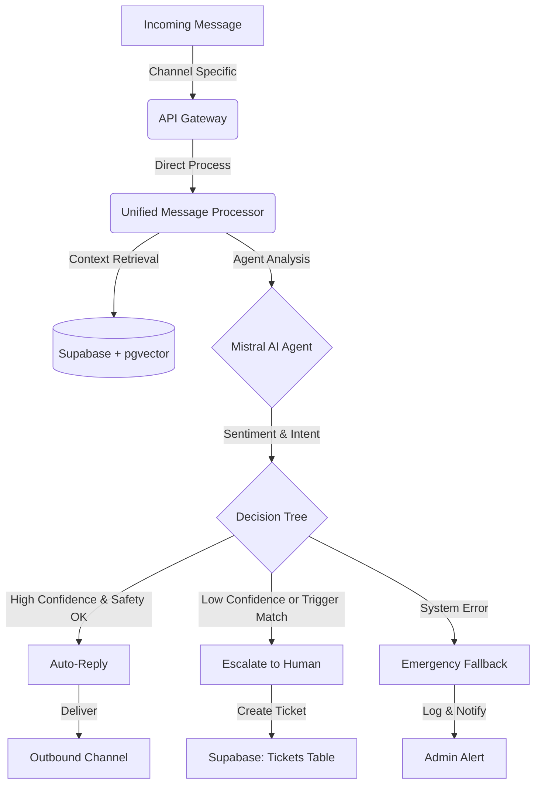

# Customer Success AI FTE (Digital Employee)

## 📝 Overview

This project delivers a production-ready, multi-channel **Customer Success AI Agent** that functions as a Full-Time Equivalent (FTE) representative. The system autonomously manages customer inquiries across **WhatsApp**, **Web Forms**, and **Email**, ensuring consistent, high-quality support with intelligent human-in-the-loop (HITL) escalation.

---

## 🧠 Agent Logic Flow

The core of the system is a streamlined, Supabase-centric architecture that ensures every message is processed with precision and safety.



### The Processing Cycle

1.  **Ingestion**: Messages from WhatsApp (Twilio), Email (Gmail SMTP/IMAP), or Web Forms are unified into a standard format.
2.  **Orchestration**: The `UnifiedMessageProcessor` handles the logic flow directly, ensuring immediate processing and response.
3.  **Contextualization**: The system uses **Supabase** with `pgvector` to perform semantic searches over the knowledge base and retrieve historical customer data.
4.  **Reasoning**: Mistral AI analyzes the message for intent, sentiment, and risk levels.

---

## 🌲 Decision Tree: Human Escalation

The agent is designed with a "Safety First" philosophy. It automatically escalates to a human agent in the following scenarios:

| Category          | Trigger Condition                              | Rationale                                                   |
| :---------------- | :--------------------------------------------- | :---------------------------------------------------------- |
| **Sentiment**     | Score < -0.3                                   | Frustrated or angry customers require human empathy.        |
| **Confidence**    | Score < 75%                                    | If the AI is unsure of the answer, it won't hallucinate.    |
| **Legal**         | Keywords: _lawsuit, lawyer, legal, GDPR_       | High-risk topics are restricted to human experts.           |
| **Financial**     | Keywords: _refund, pricing, discount, billing_ | Specific financial approvals require human oversight.       |
| **Complexity**    | > 3 Technical questions in one query           | Complex troubleshooting often requires a deeper dive.       |
| **Human Request** | Keywords: _manager, supervisor, human_         | Explicit requests for human interaction are always honored. |

---

## 🔒 Security & PII Handling

Data protection is integrated into every layer of our Supabase-backed architecture.

- **PII Scrubbing**: The system minimizes the storage of Personally Identifiable Information (PII).
- **GDPR Compliance**: Includes a `GDPRRetentionWorker` that automatically anonymizes or deletes ticket data older than a configurable period (default: 180 days).
- **Encryption**:
  - **In Transit**: TLS 1.3 for all API and database communications.
  - **At Rest**: AES-256 encryption via **Supabase** managed PostgreSQL.
- **Audit Logging**: Every action (mode changes, human takeovers, AI replies) is logged in the Supabase `audit_logs` table.

---

## ⚡ High-Performance Architecture

We achieve response times of **under 5 seconds** through direct integration and optimization:

1.  **Async FastAPI**: Built on `asyncio`, the system handles concurrent requests without blocking.
2.  **Supabase Efficiency**: By using Supabase's managed PostgreSQL, we benefit from optimized connection pooling and high-availability infrastructure.
3.  **Semantic Search**: `pgvector` on Supabase allows for fast, O(1) similarity searches across the knowledge base.
4.  **Simplified Stack**: Removing Kafka reduced architectural complexity and network hops, further decreasing end-to-end latency for real-time channels like WhatsApp.

---

## 🛠 Tech Stack

- **Languages**: Python 3.9+, JavaScript (React)
- **Frameworks**: FastAPI, Next.js
- **Intelligence**: Mistral AI (Mistral-Large-Latest)
- **Unified Backend**: **Supabase** (PostgreSQL + Auth + Realtime)
- **Vector DB**: `pgvector` (via Supabase)
- **Infrastructure**: Docker, Kubernetes, Railway

---

## 🚀 Installation & Setup

### Quick Start

Run the integrated setup script:

```bash
chmod +x quick_start.sh
./quick_start.sh
```

### Manual Docker Setup

1.  **Clone & Configure**:
    ```bash
    cp .env.example .env
    # Add your MISTRAL_API_KEY and SUPABASE_URL/KEY
    ```
2.  **Launch**:
    ```bash
    docker-compose up --build
    ```

---

## 📧 Gmail Production Setup

To use the live email channel:

1.  Enable 2FA on your Gmail account.
2.  Generate an [App Password](https://myaccount.google.com/apppasswords).
3.  Set `SUPPORT_EMAIL_ADDRESS` and `EMAIL_PASSWORD` in your `.env`.
