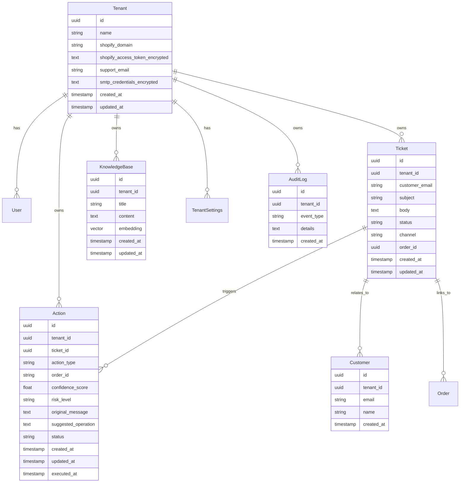

# Data Model: Shopify Customer Support AI

## Entity Relationship Diagram



## Table Definitions

### tenants

| Column | Type | Constraints | Description |
|--------|------|-------------|-------------|
| id | UUID | PK | Tenant ID |
| name | VARCHAR(255) | NOT NULL | Brand name |
| shopify_domain | VARCHAR(255) | NULLABLE | Shopify store domain |
| shopify_access_token_encrypted | TEXT | NULLABLE | Encrypted Shopify token |
| support_email | VARCHAR(255) | NULLABLE | Brand's support email |
| smtp_credentials_encrypted | TEXT | NULLABLE | Encrypted SMTP credentials |
| created_at | TIMESTAMP | DEFAULT NOW() | Creation timestamp |
| updated_at | TIMESTAMP | DEFAULT NOW() | Last update timestamp |

### tickets

| Column | Type | Constraints | Description |
|--------|------|-------------|-------------|
| id | UUID | PK | Ticket ID |
| tenant_id | UUID | FK, NOT NULL | Reference to tenant |
| customer_email | VARCHAR(255) | NOT NULL | Customer email address |
| subject | VARCHAR(500) | NOT NULL | Email/subject line |
| body | TEXT | NOT NULL | Message body |
| status | VARCHAR(50) | NOT NULL | new, processing, responded, needs_review, closed |
| channel | VARCHAR(50) | NOT NULL | email, webform |
| order_id | VARCHAR(100) | NULLABLE | Shopify order ID if referenced |
| ai_intent | VARCHAR(100) | NULLABLE | Detected intent |
| ai_sentiment | FLOAT | NULLABLE | Sentiment score -1 to 1 |
| ai_response_sent | BOOLEAN | DEFAULT FALSE | Whether AI auto-replied |
| created_at | TIMESTAMP | DEFAULT NOW() | Creation timestamp |
| updated_at | TIMESTAMP | DEFAULT NOW() | Last update timestamp |

### actions

| Column | Type | Constraints | Description |
|--------|------|-------------|-------------|
| id | UUID | PK | Action ID |
| tenant_id | UUID | FK, NOT NULL | Reference to tenant |
| ticket_id | UUID | FK, NOT NULL | Reference to ticket |
| action_type | VARCHAR(50) | NOT NULL | refund, cancel, address_change |
| order_id | VARCHAR(100) | NOT NULL | Shopify order ID |
| confidence_score | FLOAT | NOT NULL | AI confidence 0-1 |
| risk_level | VARCHAR(20) | NOT NULL | low, medium, high |
| original_message | TEXT | NOT NULL | Original customer request |
| suggested_operation | TEXT | NOT NULL | AI's suggested action |
| status | VARCHAR(50) | NOT NULL | pending, approved, rejected, executed, failed |
| error_message | TEXT | NULLABLE | Error details if failed |
| approved_by | UUID | NULLABLE | User who approved |
| executed_at | TIMESTAMP | NULLABLE | Execution timestamp |
| created_at | TIMESTAMP | DEFAULT NOW() | Creation timestamp |
| updated_at | TIMESTAMP | DEFAULT NOW() | Last update timestamp |

### knowledge_base

| Column | Type | Constraints | Description |
|--------|------|-------------|-------------|
| id | UUID | PK | Article ID |
| tenant_id | UUID | FK, NOT NULL | Reference to tenant |
| title | VARCHAR(500) | NOT NULL | Article title |
| content | TEXT | NOT NULL | Article content (markdown) |
| embedding | vector(1536) | NULLABLE | pgvector embedding |
| created_at | TIMESTAMP | DEFAULT NOW() | Creation timestamp |
| updated_at | TIMESTAMP | DEFAULT NOW() | Last update timestamp |

### audit_logs

| Column | Type | Constraints | Description |
|--------|------|-------------|-------------|
| id | UUID | PK | Log ID |
| tenant_id | UUID | FK, NOT NULL | Reference to tenant |
| event_type | VARCHAR(100) | NOT NULL | email_received, ai_processed, action_created, action_approved, action_rejected, action_executed, action_failed |
| entity_type | VARCHAR(50) | NULLABLE | ticket, action |
| entity_id | UUID | NULLABLE | Reference to entity |
| details | JSONB | NULLABLE | Event details |
| created_at | TIMESTAMP | DEFAULT NOW() | Creation timestamp |

### customers

| Column | Type | Constraints | Description |
|--------|------|-------------|-------------|
| id | UUID | PK | Customer ID |
| tenant_id | UUID | FK, NOT NULL | Reference to tenant |
| email | VARCHAR(255) | NOT NULL | Customer email |
| name | VARCHAR(255) | NULLABLE | Customer name if available |
| created_at | TIMESTAMP | DEFAULT NOW() | Creation timestamp |

## Indexes

```sql
-- Tickets by tenant and status
CREATE INDEX idx_tickets_tenant_status ON tickets(tenant_id, status);

-- Actions by tenant and status
CREATE INDEX idx_actions_tenant_status ON actions(tenant_id, status);

-- Knowledge base vector search
CREATE INDEX idx_knowledge_base_embedding ON knowledge_base USING ivfflat (embedding vector_cosine_ops);

-- Audit logs by tenant and event
CREATE INDEX idx_audit_logs_tenant_event ON audit_logs(tenant_id, event_type);
```

## Row Level Security (RLS)

All tables with tenant_id MUST have RLS enabled:

```sql
-- Example for tickets table
ALTER TABLE tickets ENABLE ROW LEVEL SECURITY;

CREATE POLICY "Tenant isolation for tickets"
ON tickets FOR ALL
USING (tenant_id = current_setting('app.current_tenant_id')::uuid);
```

## State Transitions

### Ticket Status Flow
```
new -> processing -> responded (auto-reply sent)
                     -> needs_review (action created)
                     -> closed (by user)
```

### Action Status Flow
```
pending -> approved -> executed
                 -> rejected
         -> failed (if execution error)
```

## Validation Rules

- Ticket: customer_email must be valid email format
- Action: action_type must be one of: refund, cancel, address_change
- Action: risk_level must be one of: low, medium, high
- Action: confidence_score must be between 0 and 1
- KnowledgeBase: content must not be empty